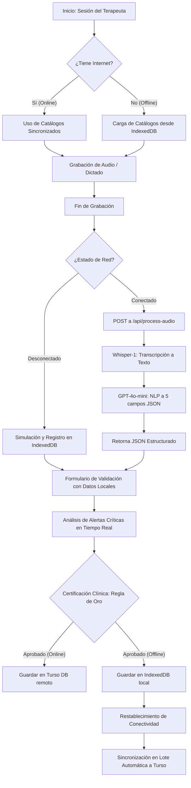

# 🕊️ Talita Kum - Registro Inteligente de Intervenciones Terapéuticas (PWA Offline-First + IA)

Talita Kum es una aplicación web progresiva (**PWA**) diseñada para optimizar y digitalizar el flujo de trabajo de terapeutas y profesionales de la salud mental en terreno o en clínica. A través de la combinación de un enfoque **Offline-First** y la potencia de **Inteligencia Artificial en tiempo real**, permite registrar intervenciones clínicas complejas mediante dictados por voz, estructurándolas automáticamente en reportes regulados de alta precisión.

---

## 🚀 Problemas Clave que Resuelve

1. **Alta Carga Administrativa**: Los terapeutas pasan gran parte de su jornada redactando bitácoras. Talita Kum convierte dictados de voz natural o textos libres en reportes estructurados en segundos.
2. **Trabajo en Terreno sin Conectividad**: En zonas de alta vulnerabilidad social o ruralidad sin cobertura móvil, la app guarda localmente grabaciones, catálogos y reportes para subirlos de forma automatizada al detectar señal.
3. **Control Clínico y Seguridad de Alertas**: Identifica patrones lingüísticos críticos (ideación suicida, crisis agudas, recaídas en adicciones) y levanta advertencias visibles inmediatamente para activar protocolos de emergencia.
4. **Cumplimiento de Estándares Clínicos**: Asegura que cada reporte contenga los 5 campos exigidos por las directrices del sector e introduce una **"Regla de Oro"** de confirmación profesional para validar los borradores generados por la IA.

---

## 🎨 Arquitectura del Flujo Clínico

El siguiente diagrama detalla cómo interactúan la PWA, la base de datos local IndexedDB, la API de OpenAI y la base de datos remota en Turso:



---

## ⚙️ Características y Funcionalidades Principales

### 🎙️ Registro de Voz con Estructuración por IA Real
* **Whisper-1 + GPT-4o-mini**: El flujo graba un archivo WebM en el cliente y lo envía por `FormData` a la API local. Whisper transcribe la voz en bruto, y GPT-4o-mini la estructura basándose en un System Prompt estricto.
* **Los 5 Campos Obligatorios**: La respuesta de la IA devuelve exactamente:
  1. `objetivo`: Propósito y metas de la sesión.
  2. `desarrollo`: Relato detallado de la intervención y conductas del paciente.
  3. `acuerdos`: Compromisos mutuos fijados para el periodo inter-sesión.
  4. `acciones` (mapeado a `accionesSeguir` en frontend): Tareas pendientes y coordinaciones próximas.
  5. `observaciones`: Estado general del paciente y notas de relevancia.
* **Inyección en Formulario**: Al recibir el JSON estructurado, se inyecta directamente como estado editable en el formulario de validación.

### 💾 Arquitectura Offline-First
* **Base de Datos IndexedDB**: Implementada para persistir intervenciones sin conexión y guardar datos de caché en los object stores `'intervenciones'` y `'catalogos'`.
* **Caché de Catálogos**: Listas de pacientes y terapeutas se guardan localmente para garantizar que el profesional pueda abrir un formulario y seleccionar los campos de control obligatorios aunque no tenga internet.
* **Auto-Sincronización en Cola**: El sistema monitorea la red mediante eventos nativos del navegador. Al detectar señal, recupera la cola IndexedDB y envía los registros pendientes a la base de datos remota mediante un Server Action por lotes.

### 🛡️ Control de Acceso Basado en Roles (RBAC) y Seguridad
* **Autenticación Robusta**: Respaldada por **Better Auth** con persistencia de sesiones.
* **Filtros de Permisos**:
  * **Terapeutas**: Permiso para usar micrófono (`canRecord`) y firmar los reportes.
  * **Administradores**: Acceso al panel de configuración de usuarios (bloquear cuentas, banear, asignar roles) y visualización del Dashboard de analítica.

### 📊 Dashboard de KPIs Administrativos
* **Tasa de Validación Clínica**: Métrica en tiempo real del cumplimiento de la "Regla de Oro".
* **Registro de Alertas Críticas**: Registro de alarmas por ideación de riesgo y crisis clínicas del centro médico.
* **Distribución de Sesiones**: Gráficas de volumen y analíticas por terapeuta.

---

## 🛠️ Stack Tecnológico

* **Frontend**: Next.js 16 (App Router), React 19 (Canary), TailwindCSS para estilos, componentes de Shadcn UI y Lucide Icons.
* **Base de Datos**: Turso DB (SQLite en la nube de baja latencia) conectado mediante **Drizzle ORM**.
* **Autenticación**: Better Auth.
* **Base de Datos Local**: IndexedDB nativa para almacenamiento estructurado offline.
* **SDK de IA**: OpenAI SDK (`whisper-1` para speech-to-text y `gpt-4o-mini` para procesamiento de lenguaje natural en formato JSON).

---

## 🔑 Credenciales para Pruebas (Demo)

El script de Seeding de base de datos incluye tres usuarios semilla de demostración:

> [!IMPORTANT]
> **Contraseña Común de Demostración:** `PasswordDemo123!`

| Rol | Profesional | Email de Prueba |
| :--- | :--- | :--- |
| **Terapeuta** | Psi. Alejandro Meléndez | `alejandro.melendez@talitakum.cl` |
| **Terapeuta** | Trabajadora Social Constanza Ruiz | `constanza.ruiz@talitakum.cl` |
| **Administrador** | Dr. Daniel Silva (Psiquiatra) | `daniel.silva@talitakum.cl` |

---

## 🛠️ Comandos de Configuración y Desarrollo

### 1. Variables de Entorno
Copia el archivo [env-example](file:///home/melendezdev/Dev/iacc/iacc-hackaton-2026/env-example) y renómbralo a `.env.local`. Configura las credenciales:

```bash
DATABASE_URL="file:local.db" # O url de conexión de Turso DB
DATABASE_AUTH_TOKEN=""       # Token de producción si usas Turso en la nube
OPENAI_API_KEY="tu-api-key-de-openai-aqui"
```

### 2. Comandos Operativos

```bash
# Instalar dependencias
pnpm install

# Iniciar servidor de desarrollo
pnpm dev

# Generar archivos de migración SQL
pnpm db:generate

# Aplicar las migraciones a la base de datos
pnpm db:migrate

# Sincronizar el esquema directamente sin migraciones en desarrollo
pnpm db:push

# Sembrar la base de datos con información inicial para demos (Recomendado)
pnpm db:seed

# Abrir consola visual de Drizzle para auditar tablas
pnpm db:studio
```
